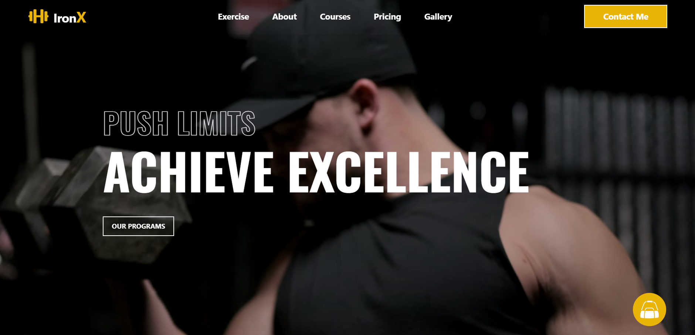

# IronX

*Your ultimate fitness companion, blending AI-driven diet plans with tailored exercise routines.*

---

## Overview

IronX is a modern web application designed for fitness enthusiasts seeking a personalized experience. This platform leverages advanced features such as AI diet and exercise generation, coupled with a sleek design, to create an engaging environment for users. Tailored for desktop and large tablet users, IronX offers beautiful animations and seamless navigation.

## Features

### 1. Modern Design

- **Feature**: A sleek and visually appealing design that enhances the user experience.
- **Details**: The layout focuses on usability and aesthetics, ensuring an engaging interface for users.
- **Screenshot**: 
- **Screenshot**: 

#### Training
- **Screenshot**: 

#### Courses
- **Screenshot**: 

#### Gallery
- **Screenshot**: 

#### Subscription section
- **Screenshot**: 

#### About and Footer
- **Screenshot**: 

### 2. AI-Powered Diet Plans

- **Feature**: Generate customized diet plans using the Gemini API.
- **Details**: Users can input their goals and preferences, receiving tailored meal suggestions to match their fitness objectives.
- **Screenshot**: 

- **Screenshot**: 

### 3. Exercise Generation

- **Feature**: Access a variety of exercise routines sourced from the ExerciseDB API.
- **Details**: Users can explore different workouts tailored to their fitness level and goals.
- **Screenshot**: 

### 4. Responsive Design

- **Feature**: Optimized for desktop and large tablet screens.
- **Note**: The application prioritizes a great experience on larger devices.
- **Screenshot**: 

### 5. Beautiful Animations

- **Feature**: Enhanced user experience through animations.
- **Details**: Utilize Framer and AOS for smooth transitions and engaging visual effects. A video replaces static images to better illustrate functionality.

### 6. Intuitive Navigation

- **Feature**: Easy navigation through React Router.
- **Details**: Users can seamlessly move between diet plans and exercise routines.

### 7. PDF Download of Diet Plans

- **Feature**: Download personalized diet plans as PDF files using jsPDF.
- **Details**: Users can easily save and print their diet plans for convenient access.
- **Screenshot**: 

## Installation

To set up HungryBaaz locally, follow these steps:

1. **Clone the repository:**

   ```bash
   git clone https://github.com/souvik-coder24/IronX.git

2. **Install dependencies:**
   ```bash
   npm install

3. **Start the development server:**
   ```bash
   npm run dev

4. **Build the project for production (optional):**
   ```bash
   cd IronX

5. **Preview the production build (optional):**
   ```bash
   npm run preview

## Contributing

We welcome contributions to IronX. To contribute:

1. **Fork the repository on GitHub.**

2. **Create a new branch:**
   ```bash
   git checkout -b feature/your-feature-name

3. **Stages all changes for the next commit:**
   ```bash
   git Add

4. **Commits the staged changes with a message describing the changes:**
   ```bash
   git commit -m "Add your feature or fix description"

5. **Pushes the committed changes to a specific branch in the remote repository:**
   ```bash
   git push origin feature/your-feature-name

6. **Open a pull request on GitHub with a detailed description of your changes.**


## Problems Faced

### ExerciseDB API Integration

- **Issue**: Integrating the ExerciseDB API posed challenges due to inconsistencies in the data format and limited documentation. This made it difficult to fetch exercise details and metadata reliably.
- **Solution**: Implemented a series of validation checks to handle varying data formats and developed custom parsing logic to ensure consistent data retrieval. Enhanced documentation review to improve integration efficiency.

### Generating PDF Responses with jsPDF

- **Issue**: Creating downloadable PDF documents using jsPDF was complicated by layout issues, particularly with images and complex formatting not rendering correctly.
- **Solution**: Focused on refining the PDF generation logic by adjusting settings and using additional libraries to better manage layout and styling, ensuring a more polished output.

### Design Consistency

- **Issue**: Maintaining design consistency across different pages and components was a challenge, leading to a disjointed user experience.
- **Solution**: Developed a comprehensive style guide and established reusable component patterns to streamline the design process and enhance overall visual cohesion.


## Future Plans

### Mobile Support

- **Plan**: Expand support to mobile screens, ensuring a responsive design that works seamlessly across all device sizes.

### Payment Integration

- **Plan**: Integrate payment processing with Razorpay to facilitate secure and efficient transactions.

### Chat Bot

- **Plan**: Add a chat bot to assist users with their queries and provide real-time support.

### Enhanced Design

- **Plan**: Continue to improve the visual design of the application, aiming for a more beautiful and intuitive user interface.

### Live Classes

- **Plan**: Introduce live classes to offer users real-time workout sessions with trainers, enhancing their fitness experience.

### Equipment and Supplements Store

- **Plan**: Launch an online store for fitness equipment, supplements, apparel, and accessories, providing users with a one-stop shop for all their fitness needs.
